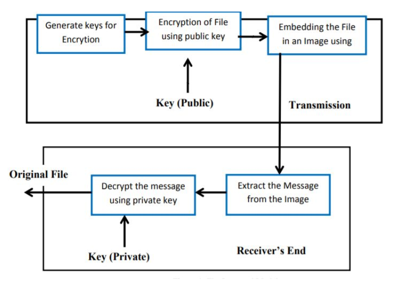
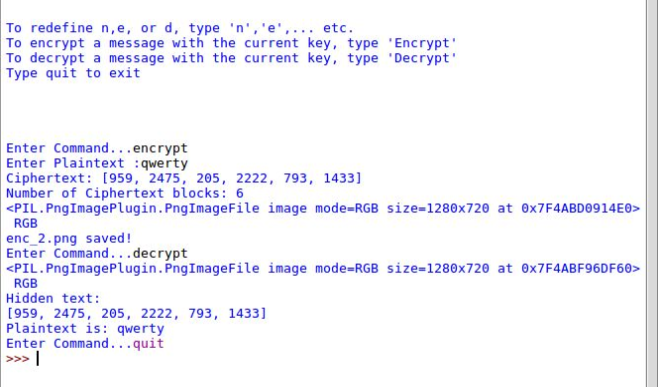
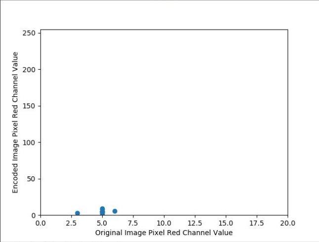
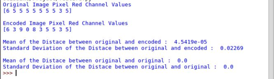

# RSAGraphy

## Image Steganography

The technique of hiding secret information or data in an image is called image steganography. Generally, pixel intensities are the methods used in hiding data in
image steganography. According to which, images are the most popular and widely use cover objects used in steganography. The degree of redundancy in images has
made it the most sought for, in terms of steganography. Two categories of classification namely spatial domain and transform domain based have been
proposed in image steganography.Various file formats exist in image steganography. TIFF, JPEG, PNG, GIF and BMP can all be implementing in image steganography .
However, each of the file formats poses its own unique advantages and disadvantages. Because pixel intensities are used in image steganography, there is
sometimes variation in the intensity of the original image and the stego image or the embedded image. Here i have used **PNG** style image steganography that will work on **BMP**.

## RSA Encryption

RSA is an algorithm used by modern computers to encrypt and decrypt messages. It is an asymmetric cryptographic algorithm. RSA stands for Ron Rivest, Adi Shamir,
and Leonard Adleman, who first publicly described it in 1978. RSA algorithm is an asymmetric cryptographic system that utilizes two set of keys to encrypt and decrypt
messages to ensure the security of quality information. In its performance, the keys are generated through a process of complex mathematical computation. The two keys
generated are called public key and private key. The public key is distributed to the sender of a message to encrypt the message whiles the receiver of a message keeps
the private key secretly to decrypt the public key encrypted message

The steps below are the processes in generating public and private keys using RSA :

1. Pick two large prime numbers p and q, p!=q;
2. Calculate n = p*q;
3. Calculate A (n) = (p-1) (q-1);
4. Pick e, so that gcd (e, A (n) ) = 1,1&lt;e&lt;(n);
5. Calculate d, so that d*e mod A (n) = 1, i.e. d is the Multiplicative inverse of e in mod A (n);
6. Get public key as Ku= {e, n}
7. Get private key as Kr= {d, n}

## R-Color-Channel Encoding

Image read using PIL (Python Image Library) and is checked if in RGB (Red, Green, Blue) format or not. If yes, then R-color-channel value is what i have updated to hide the message in the image. Following steps are considered while hiding the message:

1. Starting from (0,0) location of the image and modifying its R-channel value with the length of the message to hide.
2. Now from next pixel, encoded letter will replace the R-channel value for the corresponding pixel and move on to next pixel.
3. The above process will continue until each letter gets hidden. If a rows all pixels gets modified then next rows pixel will be taken for the process and it continues till 255 character length.

## System Architecture

## Results

##### Steganography with RSA

##### Scatter plot of difference in R-Color-Channel value of Original and Encoded image

##### Standard deviation of R-Color-Channel value between Original and Encoded image
